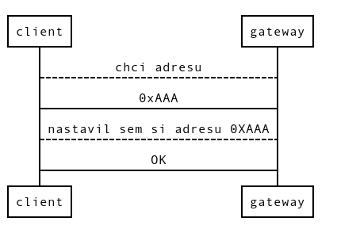

# MSSY

### úkoly
- connect (Dynamicke přidělování adres)
- discovery (Broadcastem [0xFFF])

## Instalace/config
M:\MSSY\Software\lightweight_mesh_stack_v1.2.1

1. udelat definice 
 * [LVM Developer-Guide_Application](./podklady/Atmel-42028-Lightweight-Mesh-Developer-Guide_Application-Note_AVR2130.pdf)

strana 7
Required Definitions

    F_CPU=8000000
    PHY_ATMEGARFR2
    HAL_ATMEGA256RFR2

- import
sys ,hal, nwk, phy -> do rootu

include paths

	sys/inc
	phy/atmegarfr2/inc
	hal/atmegarf2r/inc
	nwk/inc
	hal/driver/atmega256rfr2
	..

vsechny nastaveni pujdou souboru  do [config.h](./Brana/config.h)

.
 * [Brana](./Brana)
   * [hal](./Brana/hal)
     * [atmega256rfr2](./Brana/hal/atmega256rfr2)
   * [nwk](./Brana/nwk)
     * [inc](./Brana/nwk/inc)
     * [src](./Brana/nwk/src)
   * [phy](./Brana/phy)
     * [atmegarfr2](./Brana/phy/atmegarfr2)
   * [sys](./Brana/sys)
     * [inc](./Brana/sys/inc)
     * [src](./Brana/sys/src)
   * [config.h](./Brana/config.h)
`

### nase DHCP

app_addr -> nastavení adresy 

NWK_openEndpoint (cislo socketu, callback funkce po prijeti dat)

po naplneni struktu
nwk_datareq odeslia data

